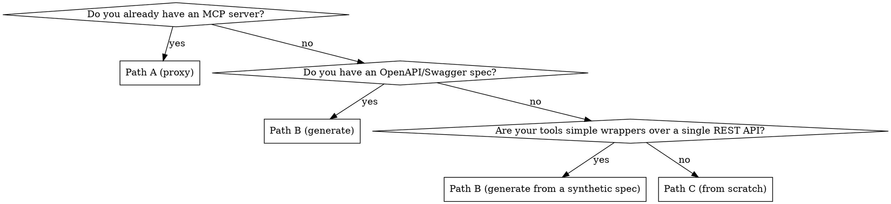

# Apify MCP Server Builder

Build an MCP (Model Context Protocol) server Actor on Apify that exposes tools to AI assistants (Claude, ChatGPT, Cursor, Claude Code). Covers the code, the manifest, the transport, the local-dev loop, and the deployment.

## Core insight: three creation paths, pick one before coding

Most people walk into this thinking they will write the server from scratch. **Nine times out of ten, you should not.** Apify ships two templates plus a generator that cover ~95% of cases. Pick the path *before* writing code — it changes the project structure entirely.

| Path | When | Starting point |
|---|---|---|
| **A — Proxy an existing MCP server** | You want to host a stdio or remote MCP server (yours or third-party) behind Apify's infrastructure with PPE billing on top | `apify create my-actor --template ts-mcp-proxy` |
| **B — Generate from OpenAPI** | You have an OpenAPI/Swagger spec and want one MCP tool per API endpoint | Run an OpenAPI-to-MCP generator Actor (search the [Apify Store](https://apify.com/store) for "mcp server generator") on your spec, then `apify push` the output |
| **C — Build from scratch** | The tools wrap proprietary logic (scrapers, multi-API orchestration, AI pipelines) that no existing MCP server covers | `apify create my-actor --template ts-mcp-server` or `--template python-mcp-server` |

**Most monetized MCP servers in the Store are Path C** (the per-tool charging fits proprietary tool logic best). **Path A is best for hosting an open-source MCP server with billing.** **Path B is best for "wrap this REST API as MCP" use cases.**

## Decision flow



## The five things every MCP server Actor must get right

These apply to all three paths. Memorize them.

### 1. `usesStandbyMode: true` in `.actor/actor.json`

MCP requires a persistent HTTP listener. Standard run mode terminates after one request. **Standby mode is non-negotiable.**

```json
{
  "actorSpecification": 1,
  "name": "my-mcp-server",
  "version": "1.0",
  "usesStandbyMode": true,
  "webServerMcpPath": "/mcp",
  "minMemoryMbytes": 256,
  "maxMemoryMbytes": 512,
  "webServerIdleTimeoutSecs": 300
}
```

- `webServerMcpPath` — the HTTP path Apify's MCP discovery hits. Use `/mcp` for Streamable HTTP, `/sse` for Legacy SSE. **Required**; if missing, Apify will not list the Actor in MCP-aware UIs.
- `webServerIdleTimeoutSecs: 300` — 5 min is the healthy default. Lower = more cold starts hurting client UX. Tune against the idle-cost trade-off (see your Apify monetization reference).
- `minMemoryMbytes: 256` — 256 MB is the practical floor for Node MCP servers; 512 MB for Python with heavier deps. Above 1 GB you start paying multiplied `apify-actor-start` events on every cold start.

### 2. Listen on `ACTOR_WEB_SERVER_PORT`, not a hardcoded port

Apify injects the port via env var. **Use it.**

```ts
// Node
const port = parseInt(process.env.ACTOR_WEB_SERVER_PORT ?? '3001');
app.listen(port);
```

```python
# Python
port = int(os.environ.get('ACTOR_WEB_SERVER_PORT', '3001'))
```

Hardcoding any other port will make the deployed Actor unreachable.

### 3. Pick the right transport — Streamable HTTP is the default

| Transport | When to use | Apify config |
|---|---|---|
| **Streamable HTTP** | Default for all new MCP servers (2025 spec) | `webServerMcpPath: "/mcp"` |
| **Legacy SSE** | Only if a target client still requires SSE | `webServerMcpPath: "/sse"` |
| **stdio** | Only inside Path A's proxy — Apify auto-converts stdio to HTTP | N/A (the proxy template handles it) |

Do **not** try to expose raw stdio from a deployed Actor — clients hit it over HTTPS. The only legitimate stdio is inside a proxy that Apify wraps.

### 4. `Actor.init()` once, never `Actor.exit()`, never `Actor.main()`

```ts
import { Actor } from 'apify';
await Actor.init();
// start the HTTP server here — it runs for the lifetime of the Standby container
// DO NOT call Actor.exit() — Standby kills the container on idle timeout, not your code
```

Wrapping the server in `Actor.main(async () => { ... })` will end the Actor after the callback returns, which on a server is immediate. Don't do it.

### 5. Charge inside the tool handler, after success, with `eventChargeLimitReached` handling

```ts
async function handleToolCall(tool, params) {
  const result = await runTool(tool, params);
  if (!result) {
    return { content: [{ type: 'text', text: 'No results found.' }] };  // no charge
  }
  const chargeResult = await Actor.charge({ eventName: `${tool}-call` });
  if (chargeResult.eventChargeLimitReached) {
    return { content: [{ type: 'text', text: 'Cost cap reached — increase cap to continue.' }] };
  }
  return { content: [{ type: 'text', text: JSON.stringify(result) }] };
}
```

Full PPE doctrine for MCP servers (event taxonomy patterns A/B/C, free-tier handling, idle-cost trade-offs, multi-tenant budget handling) belongs in your Apify monetization/PPE reference. Do not duplicate that logic — design your event taxonomy against it.

## Path A — Proxy an existing MCP server

Fastest path. Use when the MCP logic already exists (yours, open-source, or third-party) and you only need Apify to host it + bill for it.

```bash
apify create my-mcp-server --template ts-mcp-proxy
cd my-mcp-server
```

Then edit `src/main.ts` to set the child MCP command:

```ts
// Wrap a stdio MCP server (Apify converts to HTTP automatically)
const MCP_COMMAND = ['npx', '@modelcontextprotocol/server-everything'];

// OR proxy a remote HTTP MCP server
const MCP_COMMAND = [
  'npx', 'mcp-remote',
  'https://upstream-mcp.example.com/mcp',
  '--header', 'Authorization: Bearer UPSTREAM_TOKEN',
];
```

Add charging in `src/main.ts` around the proxy's tool-call middleware (see `references/path-a-proxy.md`).

## Path B — Generate from OpenAPI

Use when your tools are 1-to-1 wrappers over a documented REST API.

1. Run an OpenAPI-to-MCP generator Actor (search the [Apify Store](https://apify.com/store) for "mcp server generator") with your OpenAPI/Swagger URL or paste it inline. Output: TypeScript or Python, MCP 1.0-compliant, with auth wiring (API key / Bearer / OAuth 2.0).
2. Download the generated project.
3. Add `usesStandbyMode + webServerMcpPath` to `.actor/actor.json` (the generator's defaults).
4. Wire `Actor.charge()` per tool — the generator does not do this for you. See `references/path-c-fromscratch.md` § "Adding PPE to generated code".
5. `apify push`.

This is the most under-used path in the Store. If your tools are "GET /resources, POST /resources, DELETE /resources" wrappers, do not write them by hand.

## Path C — Build from scratch

Use when the tools wrap proprietary logic. Templates:

```bash
apify create my-mcp-server --template ts-mcp-server      # Node + @modelcontextprotocol/sdk
apify create my-mcp-server --template python-mcp-server  # Python + FastMCP
```

Minimal Node skeleton — using the **high-level `McpServer` API** (simpler for new code):

```ts
import { Actor } from 'apify';
import express from 'express';
import { McpServer } from '@modelcontextprotocol/sdk/server/mcp.js';
import { StreamableHTTPServerTransport } from '@modelcontextprotocol/sdk/server/streamableHttp.js';
import { z } from 'zod';

await Actor.init();

const mcp = new McpServer({ name: 'my-mcp', version: '1.0.0' });

mcp.tool(
  'get_github_repo_stars',
  'Returns the current star count for a public GitHub repository.',
  { owner: z.string(), repo: z.string() },
  async ({ owner, repo }) => {
    const r = await fetch(`https://api.github.com/repos/${owner}/${repo}`);
    if (!r.ok) return { content: [{ type: 'text', text: `Error: ${r.status}` }], isError: true };
    const data = await r.json();
    const charge = await Actor.charge({ eventName: 'tool-call' });
    if (charge.eventChargeLimitReached) {
      return { content: [{ type: 'text', text: 'Cost cap reached.' }] };
    }
    return { content: [{ type: 'text', text: JSON.stringify({ stars: data.stargazers_count }) }] };
  },
);

const app = express();
app.use(express.json());
app.post('/mcp', async (req, res) => {
  const transport = new StreamableHTTPServerTransport({ sessionIdGenerator: undefined });
  await mcp.connect(transport);
  await transport.handleRequest(req, res, req.body);
});

const port = parseInt(process.env.ACTOR_WEB_SERVER_PORT ?? '3001');
app.listen(port, () => console.log(`MCP listening on ${port}`));
```

**Two SDK APIs exist — pick one:**

| API | Import | Tool registration | Use for |
|---|---|---|---|
| **High-level `McpServer`** (above) | `@modelcontextprotocol/sdk/server/mcp.js` | `mcp.tool(name, desc, zodSchema, handler)` | Skeleton, simple servers, fast iteration |
| **Low-level `Server`** | `@modelcontextprotocol/sdk/server/index.js` | `setRequestHandler(ListToolsRequestSchema, ...)` + `setRequestHandler(CallToolRequestSchema, ...)` | When you need full control of the JSON-RPC envelope, custom routing, or middleware patterns. Used by the full example in `references/path-c-fromscratch.md`. |

Both are first-party and stable; the high-level wraps the low-level. Don't mix them in the same Actor.

Minimal Python skeleton (FastMCP):

```python
import os
from apify import Actor
from mcp.server.fastmcp import FastMCP
import httpx

async def main():
    async with Actor:
        mcp = FastMCP('my-mcp')

        @mcp.tool()
        async def get_github_repo_stars(owner: str, repo: str) -> dict:
            """Returns the current star count for a public GitHub repository."""
            async with httpx.AsyncClient() as client:
                r = await client.get(f'https://api.github.com/repos/{owner}/{repo}')
                r.raise_for_status()
                data = r.json()
            charge = await Actor.charge(event_name='tool-call')
            if charge.event_charge_limit_reached:
                return {'error': 'Cost cap reached.'}
            return {'stars': data['stargazers_count']}

        port = int(os.environ.get('ACTOR_WEB_SERVER_PORT', '3001'))
        await mcp.run_streamable_http_async(host='0.0.0.0', port=port, path='/mcp')

if __name__ == '__main__':
    import asyncio
    asyncio.run(main())
```

Full working examples (Dockerfile, package.json, dataset_schema, error envelope) live in **`references/path-c-fromscratch.md`**.

## Authentication

Apify handles auth at the platform edge — your Actor code does not authenticate the caller. The MCP client sends:

```
Authorization: Bearer <APIFY_API_TOKEN>
```

Or as a query param fallback (for clients that can't set headers):

```
https://<user>--<actor>.apify.actor/mcp?token=<APIFY_API_TOKEN>
```

The user's identity (for billing) flows from the token. `Actor.charge()` bills whoever owns the token. You do not need to re-implement auth.

**One exception:** if your tools talk to a third-party API (GitHub, OpenAI, Stripe), users pass *their* credentials via Actor input (Path C) or via headers in the proxy command (Path A). Never log those values. Set sensitive defaults in the Apify Console UI under the Actor's settings, never in `actor.json`.

## URL pattern after deployment

```
https://<username>--<actor-name>.apify.actor/<webServerMcpPath>
```

Examples:
- `https://your-username--github-stars-mcp.apify.actor/mcp` (Streamable HTTP)
- `https://your-username--legacy-mcp.apify.actor/sse` (Legacy SSE)

The username is your Apify username (lowercased, hyphens). The double-dash separates user and actor.

## Local development loop

```bash
APIFY_META_ORIGIN="STANDBY" ACTOR_WEB_SERVER_PORT=8080 apify run
```

The `APIFY_META_ORIGIN=STANDBY` env var is what tells the Apify SDK to start in Standby mode rather than batch mode. Without it, `apify run` will try to run-once-and-exit.

Then test with **MCP Inspector**:

```bash
npx @modelcontextprotocol/inspector
# Open the UI, set URL to http://localhost:8080/mcp
# Confirm tools/list shows your tools, invoke each, check Actor logs
```

`Actor.charge()` is a no-op locally (it logs but does not bill). Charges are only enforced on the Apify platform.

## Deployment & verification

```bash
apify login
apify push
```

Then in the Apify Console:
1. **Settings → Standby** — verify status is "Ready" and the URL is shown.
2. Hit the URL with `curl -i -H "Authorization: Bearer $APIFY_TOKEN" https://<user>--<actor>.apify.actor/mcp` — expect a 200 (or method-not-allowed on GET, depending on transport).
3. Run MCP Inspector pointing at the production URL with your token. Confirm `tools/list` returns the expected tools and one tool invocation succeeds.
4. Check **Runs** tab — the Standby request should appear as a run with chargeable events.
5. **Source-code hygiene — CRITICAL.** `apify push` uploads ALL git-tracked files, and `isSourceCodeHidden: true` only hides the Console UI — the public API (`apify actors info --json`) still exposes every `sourceFiles[]` (content included) to any authenticated user. For a bundled TS MCP server (tsc/tsup → `dist/`), NEVER upload `src/` (your server logic/tool implementations = IP), `tests/`, or `*.map` (source maps reconstruct the TS) — only the build output + runtime config the Dockerfile needs. `.gitignore` does NOT help (tracked files upload anyway); deploy from a **staging dir** with a deploy allowlist (a pre-push script that copies only the allowlisted files into the staging dir before `apify push`). Verify the latest `versions[0].sourceFiles[].name` with Python (⚠️ `jq` is often absent → `… | jq … || echo ok` silently false-passes); set `isSourceCodeHidden: true`. Already-pushed builds keep their exposed source — fixing future pushes does not purge the past.

## Common mistakes

| Mistake | Symptom | Fix |
|---|---|---|
| Forgetting `usesStandbyMode: true` | Deployed Actor returns 404 on the URL; no Standby tab in Console | Add the field, `apify push` again |
| Hardcoded port | Container starts but request never reaches your handler | Read `ACTOR_WEB_SERVER_PORT` |
| `Actor.main()` wrapper around the server | Container starts and exits in 1 second | Remove `Actor.main()`, use bare `await Actor.init()` then `app.listen()` |
| Charging before tool work completes | Users charged on errors, refund requests | Move `Actor.charge()` after the success path, before the response |
| Skipping `eventChargeLimitReached` check | Free-plan users see infinite responses but creator earns nothing | Read the `ChargeResult`, return a clear MCP message when cap is hit |
| 4 GB default memory | Multiplied `apify-actor-start` charges on every cold start | Set `maxMemoryMbytes: 512` |
| Idle timeout 1 hour | High platform cost during low usage | Set `webServerIdleTimeoutSecs: 300` |
| Hardcoding API tokens in `actor.json` | Tokens leak to Apify Store source files | Use Apify Console UI env vars; mark `.actor.json` as containing no secrets |
| Hardcoded `webServerMcpPath: "/sse"` while using Streamable HTTP | MCP discovery fails, clients can't connect | Match `webServerMcpPath` to the transport in code (`/mcp` for Streamable HTTP) |
| No `Authorization` header in the client config | Connection works but tool calls return 401 | Add `Bearer <APIFY_TOKEN>` to client headers |
| Calling a rate-limited third-party API without auth | Tool fails for some users with 429 once the shared Apify egress IP hits the third party's anonymous quota (e.g. GitHub: 60 req/h/IP unauthenticated) | KV Store cache + optional user-supplied tokens; see `references/path-c-fromscratch.md` § "Third-party API rate limits" |
| Mixing `McpServer` (high-level) and `Server` (low-level) APIs in the same Actor | Type errors, tool registrations silently ignored | Pick one — high-level for simple servers, low-level for full control. See Path C skeleton above. |

## When NOT to ship as an MCP server

Sometimes the right answer is "this should be a regular Actor, not MCP". Short version: if it's one-shot (give input, get output), if data updates rarely, or if the audience is humans in the Console, a plain PPE Actor is simpler and cheaper.

## Cross-references

- **PPE / pricing / event taxonomy for MCP** → your Apify monetization/PPE reference
- **README + input/dataset schemas + Store description for MCP variants** → your Apify Actor content/README reference
- **General Apify Actor patterns (actor.json, KV cache, status messages, base Docker images)** → your Apify scraper-patterns reference
- **Graceful-exit error handling that applies inside MCP tool handlers** → your Apify error-handling reference
- **MCP-server-specific deep reference (transports, full code, debugging)** → `references/` folder of this skill

## Reference files in this skill

- `references/path-a-proxy.md` — full Path A worked example (`ts-mcp-proxy`)
- `references/path-c-fromscratch.md` — full Path C worked examples (Node + Python), Dockerfile, package.json, error envelope, lazy loading for cold-start mitigation
- `references/transports.md` — Streamable HTTP vs Legacy SSE vs stdio, when each one is required, MCP Inspector config per transport
- `references/checklist-publish.md` — pre-publish verification, post-deploy smoke test, what to check in the Apify Console

## Part of the mr-bridge.com toolkit

This skill is part of the [mr-bridge.com](https://mr-bridge.com) toolkit for scraping, data, and content automation. Related resources:

- [Scrapers](https://mr-bridge.com/scrapers) — Apify Actor portfolio
- [MCP servers](https://mr-bridge.com/mcp-servers) — Model Context Protocol servers
- [AI workflows](https://mr-bridge.com/ai-workflows) — agents and automation
- [Studies](https://mr-bridge.com/studies) — data studies and one-pagers
- [Articles](https://mr-bridge.com/articles) — write-ups and guides
- [Solutions](https://mr-bridge.com/solutions) — end-to-end solutions
